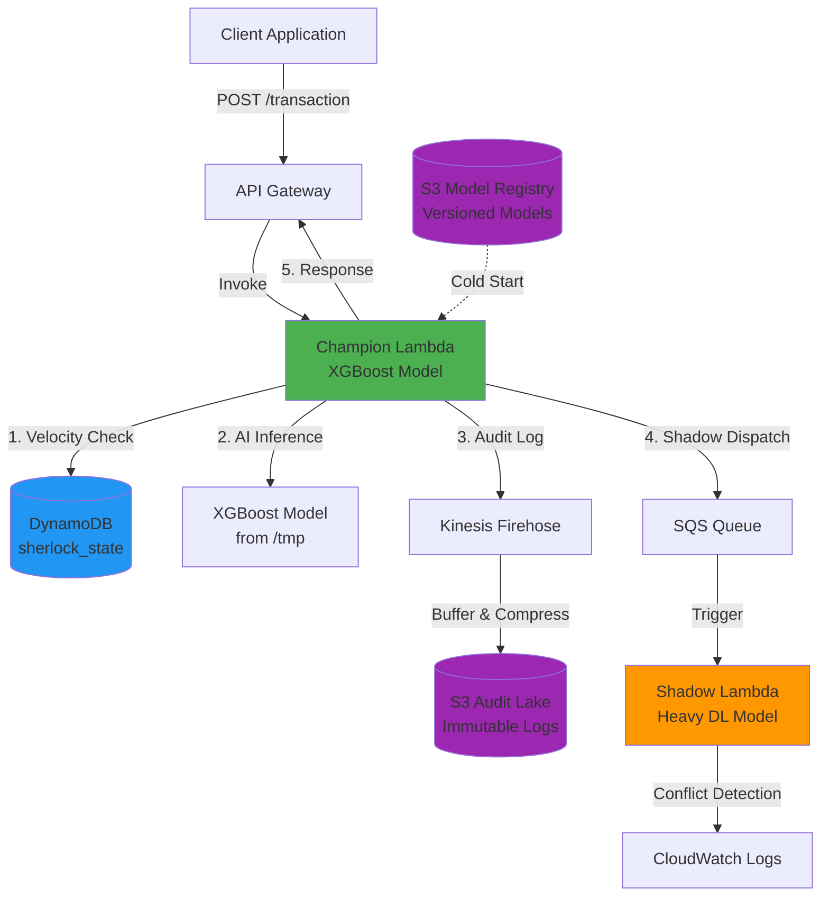

# Serverless Sherlock - Fraud Detection System

Production-grade fraud detection system mimicking Revolut's "Sherlock" architecture with **<50ms latency**, **Shadow Mode** for safe deployments, and comprehensive auditability using AWS serverless services.

## 🏗️ Architecture



## 🎯 Key Features

### ⚡ Speed (<50ms Target)
- **Global State Management**: Model loaded once per Lambda container
- **DynamoDB Atomic Operations**: Single round-trip for velocity checks
- **Asynchronous Audit Logging**: Non-blocking Kinesis Firehose
- **Optimized Cold Starts**: Minimal initialization overhead

### 🛡️ Shadow Mode (Safe Deployments)
- **Dual Evaluation**: All transactions evaluated by both Champion and Shadow models
- **Conflict Detection**: Automatic logging of decision disagreements
- **Zero Production Impact**: Shadow decisions don't affect user experience
- **A/B Testing Ready**: Safe model rollout and validation

### 📊 Auditability
- **Immutable Audit Trail**: All transactions logged to S3 via Kinesis Firehose
- **Partitioned Storage**: Organized by year/month/day for efficient querying
- **Versioned Models**: S3 versioning tracks all model deployments
- **Point-in-Time Recovery**: DynamoDB PITR enabled

## 📁 Project Structure

```
serveless_sherlok/
├── main.tf                      # Terraform infrastructure
├── outputs.tf                   # Terraform outputs
├── champion_function.py         # Main fraud detection Lambda
├── shadow_function.py           # Shadow model Lambda
├── setup_system.py              # Model creation & upload utility
├── load_test.py                 # Concurrent load testing
├── build_lambda_package.sh      # XGBoost layer builder
├── requirements.txt             # Python dependencies
└── README.md                    # This file
```

## 🚀 Deployment

### Prerequisites

- AWS CLI configured with appropriate credentials
- Terraform >= 1.0
- Python 3.11
- Bash shell

### Step 1: Install Dependencies

```bash
cd /home/rockylinux/devel/serveless_sherlok

# Install Python dependencies
pip install -r requirements.txt
```

### Step 2: Build Lambda Layer

```bash
# Build XGBoost layer
chmod +x build_lambda_package.sh
./build_lambda_package.sh
```

This creates `lambda_layer.zip` (~50MB) containing XGBoost and dependencies.

### Step 3: Deploy Infrastructure

```bash
# Initialize Terraform
terraform init

# Review plan
terraform plan

# Deploy
terraform apply -auto-approve
```

**Expected Resources**:
- 2 S3 buckets (Model Registry, Audit Lake)
- 1 DynamoDB table (sherlock_state)
- 1 Kinesis Firehose stream
- 2 SQS queues (main + DLQ)
- 2 Lambda functions (Champion, Shadow)
- 1 API Gateway HTTP API
- IAM roles and policies

### Step 4: Upload Model

```bash
# Get bucket name from Terraform output
MODEL_BUCKET=$(terraform output -raw model_registry_bucket)

# Create and upload model
python3 setup_system.py $MODEL_BUCKET
```

### Step 5: Test API

```bash
# Get API URL from Terraform output
API_URL=$(terraform output -raw api_invoke_url)

# Test with setup script
python3 setup_system.py $MODEL_BUCKET $API_URL
```

## 🧪 Testing

### Single Transaction Test

```bash
API_URL=$(terraform output -raw api_invoke_url)

curl -X POST $API_URL \
  -H "Content-Type: application/json" \
  -d '{
    "user_id": "user_001",
    "amount": 250.00,
    "location": "New York",
    "merchant": "Amazon",
    "transaction_id": "test_001"
  }'
```

**Expected Response**:
```json
{
  "status": "ALLOW",
  "transaction_id": "test_001",
  "risk_score": 45.23,
  "reasons": [],
  "velocity_counter": 1,
  "latency_ms": 23.45
}
```

### Load Testing

```bash
# Run 100 requests with 50 concurrent workers
python3 load_test.py $API_URL 100 50
```

**Expected Output**:
- Success rate: >99%
- Average latency: <100ms (total round-trip)
- Server latency: <50ms (Lambda only)
- Decision distribution (ALLOW vs BLOCK)
- Performance metrics (P50, P95, P99)

### Fraud Scenario Testing

```python
# High Velocity (6+ transactions in 60s)
for i in range(7):
    curl -X POST $API_URL -H "Content-Type: application/json" \
      -d '{"user_id": "user_001", "amount": 100, "location": "NYC", "merchant": "Store"}'
    sleep 1
```

Expected: 6th+ transaction flagged with `HIGH_VELOCITY`

```python
# Impossible Travel (same user, different locations)
curl -X POST $API_URL -d '{"user_id": "user_002", "location": "New York", ...}'
curl -X POST $API_URL -d '{"user_id": "user_002", "location": "Tokyo", ...}'
```

Expected: 2nd transaction flagged with `IMPOSSIBLE_TRAVEL`

## 📊 Monitoring

### CloudWatch Logs

```bash
# Champion Lambda logs
aws logs tail /aws/lambda/sherlock-champion --follow

# Shadow Lambda logs (look for conflicts)
aws logs tail /aws/lambda/sherlock-shadow --follow
```

**Shadow Conflict Example**:
```
⚠️ CONFLICT DETECTED: Champion [ALLOW] vs Shadow [BLOCK]
   User: user_042, Amount: $523.45
   Champion Risk: 65.23, Shadow Risk: 82.91
```

### DynamoDB State

```bash
# Check velocity counters
aws dynamodb scan \
  --table-name sherlock_state \
  --region us-east-1
```

### Audit Trail

```bash
# List audit logs
AUDIT_BUCKET=$(terraform output -raw audit_lake_bucket)
aws s3 ls s3://$AUDIT_BUCKET/transactions/ --recursive

# Download recent logs
aws s3 cp s3://$AUDIT_BUCKET/transactions/year=2026/month=01/day=12/ . --recursive
```

## 🔧 Configuration

### Environment Variables (Champion Lambda)

| Variable | Description | Example |
|----------|-------------|---------|
| `DYNAMODB_TABLE` | State table name | `sherlock_state` |
| `SHADOW_QUEUE_URL` | SQS queue URL | `https://sqs.us-east-1...` |
| `FIREHOSE_STREAM` | Firehose stream name | `sherlock-audit-stream` |
| `MODEL_BUCKET` | S3 model bucket | `sherlock-model-registry-...` |
| `MODEL_KEY` | Model S3 key | `model.json` |

### DynamoDB Schema

**Table**: `sherlock_state`

| Attribute | Type | Description |
|-----------|------|-------------|
| `user_id` | String (PK) | User identifier |
| `velocity_counter` | Number | Transaction count in window |
| `last_location` | String | Last transaction location |
| `ttl_window` | Number | TTL expiration timestamp |

**TTL**: Auto-expires records after 60 seconds

### Fraud Detection Rules

1. **High Velocity**: `velocity_counter > 5` in 60s window
2. **Impossible Travel**: Different `location` with `velocity_counter > 1`
3. **High Risk Score**: XGBoost model output > 80

**Decision Logic**: BLOCK if any rule triggers, otherwise ALLOW

## 💰 Cost Estimates

**Monthly Cost (1M transactions)**:

| Service | Usage | Cost |
|---------|-------|------|
| Lambda (Champion) | 1M invocations × 512MB × 50ms | ~$1.50 |
| Lambda (Shadow) | 1M invocations × 256MB × 200ms | ~$1.20 |
| DynamoDB | 1M writes + 1M reads (on-demand) | ~$2.50 |
| API Gateway | 1M requests | ~$1.00 |
| Kinesis Firehose | 1M records (~1GB) | ~$0.50 |
| S3 | 10GB storage + requests | ~$0.30 |
| **Total** | | **~$7.00/month** |

**Free Tier Benefits**:
- Lambda: 1M free requests/month
- DynamoDB: 25GB free storage
- S3: 5GB free storage

## 🐛 Troubleshooting

### Lambda Cold Starts

**Symptom**: First request takes >500ms

**Solution**: 
- Provisioned concurrency (costs extra)
- Keep containers warm with scheduled pings
- Optimize model loading (use smaller models)

### Model Not Found

**Symptom**: `Model loading failed: NoSuchKey`

**Solution**:
```bash
# Re-upload model
python3 setup_system.py $(terraform output -raw model_registry_bucket)
```

### High Latency

**Symptom**: Latency >50ms consistently

**Diagnosis**:
1. Check CloudWatch Logs for bottlenecks
2. Verify DynamoDB is in same region
3. Check network latency to API Gateway
4. Review XGBoost model complexity

**Solutions**:
- Increase Lambda memory (faster CPU)
- Use DynamoDB DAX for caching
- Optimize model (reduce trees/depth)

### Shadow Queue Backlog

**Symptom**: SQS queue depth increasing

**Solution**:
```bash
# Increase Shadow Lambda concurrency
aws lambda put-function-concurrency \
  --function-name sherlock-shadow \
  --reserved-concurrent-executions 100
```

## 🔐 Security Best Practices

1. **API Gateway**: Add API keys or AWS IAM authentication
2. **Encryption**: Enable S3 encryption at rest (SSE-S3 or KMS)
3. **VPC**: Deploy Lambdas in VPC for network isolation
4. **Secrets**: Use AWS Secrets Manager for sensitive configs
5. **Least Privilege**: Review IAM policies regularly

## 🚧 Future Enhancements

- [ ] **Real-time Dashboards**: Grafana + CloudWatch metrics
- [ ] **Model Versioning**: A/B test multiple models simultaneously
- [ ] **Feature Store**: Centralized feature management
- [ ] **Auto-scaling**: Dynamic Lambda concurrency based on load
- [ ] **Multi-region**: Active-active deployment for global latency
- [ ] **Graph Analysis**: Neo4j for fraud ring detection
- [ ] **Explainability**: SHAP values for model transparency

## 📚 References

- [Revolut's Sherlock Architecture](https://www.revolut.com/blog/post/how-we-use-machine-learning-to-detect-fraud/)
- [AWS Lambda Best Practices](https://docs.aws.amazon.com/lambda/latest/dg/best-practices.html)
- [XGBoost Documentation](https://xgboost.readthedocs.io/)
- [DynamoDB TTL](https://docs.aws.amazon.com/amazondynamodb/latest/developerguide/TTL.html)

## 📝 License

MIT License - See LICENSE file for details

## 🤝 Contributing

Contributions welcome! Please open an issue or PR.

---

**Built with ❤️ for production-grade fraud detection**
